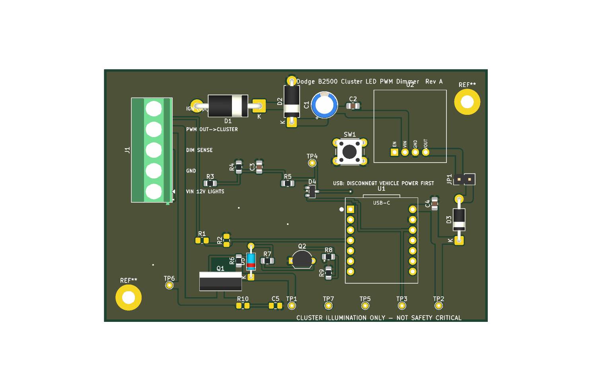

# Dodge B2500 Instrument Cluster LED PWM Dimmer

Small RP2040-based PWM dimmer board for a 1996 Dodge B2500 instrument cluster
LED conversion. It reads the factory headlight rheostat as an analog input and
drives the cluster illumination feed with a protected high-side 12 V PWM output.

> **Cluster illumination only.** This board is not for exterior lighting, brake
> lights, turn signals, airbags, engine controls, or any safety-critical
> circuit.



---

## How it works

```
factory full 12 V illumination/headlamp-switched feed  -> J1 VIN_RAW
factory dimmer/rheostat analog output                  -> J1 DIM_IN  (sense only)
board high-side 12 V PWM output                        -> J1 PWM_OUT -> cluster LED +
cluster/chassis ground                                 -> J1 GND
```

The factory rheostat no longer powers the cluster lamps. It is read as a
low-current analog control signal through a high-impedance divider into the
XIAO RP2040 ADC. Firmware maps that voltage through a gamma curve to a high-side
PWM output (P-channel MOSFET Q1 driven by N-MOSFET Q2), so the lamp grounds stay
factory.

### Connector (J1)

| Pin | Net        | Description                                            |
|----:|------------|--------------------------------------------------------|
| 1   | `VIN_RAW`  | Fused full 12 V illumination/headlight-switched feed   |
| 2   | `GND`      | Chassis/cluster ground                                 |
| 3   | `DIM_IN`   | Factory rheostat output, sense only                    |
| 4   | `PWM_OUT`  | PWM +12 V output to cluster LED illumination feed      |
| 5   | `IGN_SENSE`| Optional lights-on signal (future firmware; DNP parts) |

### Install concept

1. Identify the factory cluster illumination/dimmer feed with a multimeter and
   wiring diagram.
2. Cut or depin the cluster illumination feed so the rheostat no longer powers
   the LED bulbs directly.
3. Connect the **vehicle/rheostat side** of that wire to `DIM_IN`.
4. Connect the **cluster/lamp side** of that wire to `PWM_OUT`.
5. Power the board from a fused full-bright illumination feed that is hot when
   park/headlights are on — **not** from the dimmed rheostat output.
6. Ground the board to the cluster/chassis ground.

> Do **not** power the microcontroller from `DIM_IN`; it may brown out when the
> rheostat is turned down.
>
> If the factory dimmer turns out to be low-side, already-PWM, or multiplexed
> rather than a simple variable positive voltage, **stop** and revise the input
> circuit instead of forcing this design.

---

## Repository layout

```
.
├── README.md
├── firmware/                     PlatformIO project (Seeed XIAO RP2040)
│   ├── platformio.ini
│   └── src/main.cpp
└── hardware/
    ├── kicad/
    │   ├── b2500_cluster_pwm_dimmer.kicad_pro / .kicad_sch / .kicad_pcb
    │   ├── b2500_cluster_pwm_dimmer_schematic.pdf
    │   ├── pcb_top.png
    │   └── symbols_and_footprints/b2500.pretty/   (XIAO + Pololu module footprints)
    ├── scripts/                  generators (re-create the design deterministically)
    │   ├── netlist.py            single source of truth for the netlist
    │   ├── gen_sch.py            -> kicad_sch
    │   ├── gen_pcb.py            -> kicad_pcb
    │   ├── gen_bom.py            -> BOM CSV
    │   └── export_fab.py         -> gerbers + drill + BOM (run after routing)
    ├── gerbers/                  fabrication output (generated after routing)
    ├── fabrication_notes.md
    └── b2500_cluster_pwm_dimmer_bom.csv
```

The KiCad schematic, board, and BOM are generated by the scripts in
`hardware/scripts/`. They share `netlist.py` so the schematic and board can
never drift apart. Regenerate with:

```powershell
python hardware/scripts/gen_sch.py                       # schematic
& "C:/Program Files/KiCad/10.0/bin/python.exe" hardware/scripts/gen_pcb.py   # board (needs KiCad's Python)
python hardware/scripts/gen_bom.py                       # BOM CSV
```

---

## Firmware

Built with PlatformIO for the Seeed Studio XIAO RP2040 (Arduino / Earle
Philhower RP2040 core).

```bash
cd firmware
pio run            # build
pio run -t upload  # flash (board in UF2 bootloader, or via USB)
pio device monitor # 115200 baud serial debug
```

Key calibration constants live at the top of `firmware/src/main.cpp`
(`ADC_OFF_THRESHOLD`, `ADC_MIN_INPUT`, `ADC_MAX_INPUT`, `DUTY_MIN`, `GAMMA`,
`PWM_FREQ_HZ`, plus `REVERSE_DIMMER_DIRECTION`). Tune them on the bench against
the real dimmer using the serial output. PWM defaults to 976 Hz (in the
500 Hz–2 kHz target band).

---

## PCB

The board is **fully routed and DRC-clean** (0 violations, 0 unconnected) —
2 layers, 94 × 62 mm, ground pour on both. `hardware/scripts/gen_pcb.py`
places every part, pours ground, and routes all nets with a built-in
collision-aware router (Manhattan + maze fallback): high-current nets
(`VIN_RAW`, `PWM_OUT`, `VIN_PROT`) at 1.5 mm, signals at 0.4 mm. The gerbers and
drill files in `hardware/gerbers/` are ready to send to a fabricator.

You don't need to touch KiCad to get the board made. If you *want* to inspect or
tweak it:

1. Open `hardware/kicad/b2500_cluster_pwm_dimmer.kicad_pro` in KiCad 10.
2. Make changes, run DRC, then regenerate fabrication output:

   ```powershell
   python hardware/scripts/export_fab.py
   ```

   This runs DRC, writes gerbers + Excellon drill to `hardware/gerbers/`, and
   regenerates the BOM. (Re-running `gen_pcb.py` regenerates the whole board
   from scratch and will discard manual KiCad edits.)

### Ordering the board

Zip the contents of `hardware/gerbers/` and upload to any PCB fab (JLCPCB,
PCBWay, OSH Park, Aisler, etc.): 2-layer, 1.6 mm, 1 oz copper (2 oz is a nice
upgrade for the power path), HASL or ENIG. See
[hardware/fabrication_notes.md](hardware/fabrication_notes.md) for the full
spec, assembly notes, and the bench/in-vehicle test procedures.

---

## Deviations from the original brief

- **Board size** is ~94 × 62 mm, not the 50 × 35 mm target. The through-hole
  part set (5-pos 5.08 mm terminal block, TO-220, two modules, radial cap, seven
  test points, button) does not fit smaller while staying hand-solderable. A
  compact SMD-MOSFET / smaller-connector variant is a sensible future revision.
- **Q1 gate pull-up R6 is 10 k (brief said 47 k)** and a **DNP R10/C5 RC snubber
  footprint** sits across `PWM_OUT` — both for a cleaner, better-defined
  high-side switching edge with less ringing/EMI. Fit the snubber only if the
  bench scope shows ringing.
- **Two M3 mounting holes** (per the BOM, M1–M2), placed diagonally — the
  terminal block fills the left edge, so a top-left hole was not possible.
- The board is routed by a **purpose-built script router**, not by hand in
  KiCad. It is DRC-clean and electrically complete, but the trace paths are
  Manhattan/maze-style rather than artistically dressed; feel free to prettify
  in the GUI if you re-spin.
- The XIAO USB-C port is not on a board edge; for in-place reflashing, prefer
  the UF2 bootloader or relocate U1 to an edge in a future revision.

## Safety

- Always fuse `VIN_RAW` (inline blade fuse in the harness — F1 is not on the
  board). Size it to the measured LED cluster current.
- Do not route the cluster output back through the factory rheostat.
- Do not connect USB while the board is vehicle-powered unless JP1 is open / the
  D3 isolation diode is fitted, to avoid 5 V backfeed.
- This is not OEM-grade load-dump protection. The TVS + wide-input regulator
  reduce risk but do not eliminate it.
- Carry a bypass jumper during early testing so the cluster lamps can be
  restored if the board fails.
